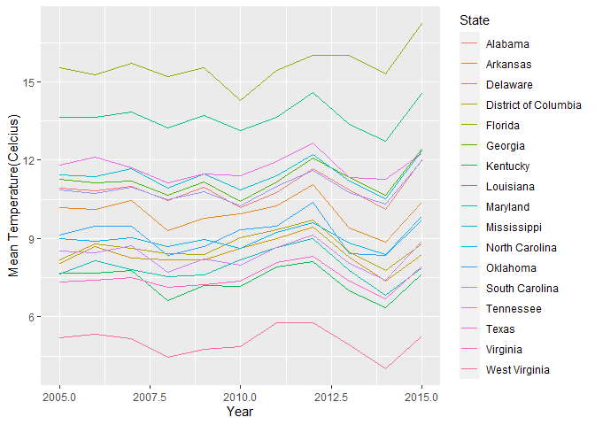
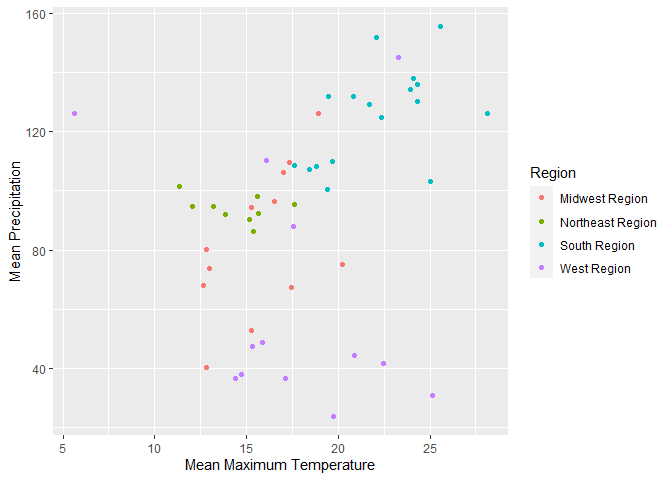

Geog4/6300: Lab 1
================

## Loading data into R, data transformation, and summary statistics

**Value:** 20 points

**Overview:**

This lab is intended to assess your ability to use R to load data and to
generate basic descriptive statistics. You’ll be using monthly weather
data from the Daymet climate database (<http://daymet.ornl.gov>) for all
counties in the United States over a 10 year period (2005-2015). These
data are available on the Github repo for our course. The following
variables are provided:

  - gisjn\_cty: Code for joining to census data
  - year: Year of observation
  - month: Month of observation
  - dayl: Mean length of daylight (in seconds)
  - srad: Mean solar radiation per day
  - tmax: Mean maximum recorded temperature (Celsius)
  - tmin: Mean minimum recorded temperature (Celsius)
  - vap\_pres: Mean vapor pressure (indicative of humidity)
  - prcp: Total recorded prcpitation (mm)
  - cty\_name: Name of the county
  - state: state of the county
  - region: Census region (map:
    <https://www2.census.gov/geo/pdfs/maps-data/maps/reference/us_regdiv.pdf>)
  - division: Census division
  - lon: Longitude of the point
  - lat: Latitude of the point

These labs are meant to be done collaboratively, but your final
submission should demonstrate your own original thought (don’t just copy
your classmate’s work or turn in identical assignments). Your answers to
the lab questions should be typed in the provided RMarkdown template.
You’ll then “knit” this to an Github document and upload it to your
class Github repo.

**Procedure:**

Load the tidyverse package and import the data:

``` r
library(tidyverse)
daymet_data <- read_csv("data/Daymet_Cty_Summary_2005_2015.csv")
```

We can look at the first few rows of the dataset using the *head*
function. We also use *kable* to format this nicely.

``` r
kable(head(daymet_data))
```

| gisjn\_cty | year | month |     dayl |     srad |     tmax |       tmin | vap\_pres | prcp | CTY\_NAME | State   | Region       | Division                    |        Lon |    Lat |
| :--------- | ---: | :---- | -------: | -------: | -------: | ---------: | --------: | ---: | :-------- | :------ | :----------- | :-------------------------- | ---------: | -----: |
| G01001     | 2005 | Apr   | 46137.60 | 420.6933 | 23.13333 |  9.4666667 | 1210.6667 |  195 | Autauga   | Alabama | South Region | East South Central Division | \-86.64257 | 32.535 |
| G01001     | 2005 | Aug   | 47380.65 | 364.3871 | 31.58065 | 22.0322581 | 2649.0323 |  150 | Autauga   | Alabama | South Region | East South Central Division | \-86.64257 | 32.535 |
| G01001     | 2005 | Dec   | 35663.77 | 258.5806 | 13.33871 |  0.1774194 |  637.4194 |   69 | Autauga   | Alabama | South Region | East South Central Division | \-86.64257 | 32.535 |
| G01001     | 2005 | Feb   | 39028.11 | 297.2571 | 16.60714 |  5.4107143 |  935.7143 |  152 | Autauga   | Alabama | South Region | East South Central Division | \-86.64257 | 32.535 |
| G01001     | 2005 | Jan   | 36444.06 | 261.5742 | 15.75806 |  3.5483871 |  855.4839 |   75 | Autauga   | Alabama | South Region | East South Central Division | \-86.64257 | 32.535 |
| G01001     | 2005 | July  | 50045.13 | 350.2452 | 31.37097 | 22.0483871 | 2649.0323 |  284 | Autauga   | Alabama | South Region | East South Central Division | \-86.64257 | 32.535 |

***Question 1 (4 points):** After loading the file into R, pick TWO
variables and determine whether they are nominal, ordinal, interval, and
ratio data. Justify the classification you chose in a sentence or two
for each one.*

{The CTY\_NAME variable is a nominal variable. The only characteristic
it has is a name which is a qualitative variable. The second variable is
REGION. REGION is a categorical variable because it is a qualitative
variable that has important differences within its own class i.e. SE is
different than NW; not better or worse, just different.}

There are a lot of observations here, 413,820 to be exact. To get a
better grasp on it, we can use group\_by and summarize in the tidyverse
package, which we covered in class. This will allow us to identify the
mean value for each year by county across the study period.

***Question 2 (4 points):** Use group\_by and summarize to calculate the
mean minimum temperature for each year by county, also including State
and Region as grouping variables. Your resulting dataset should show the
value of tmin for each county in each year. Use the kable and head
functions as shown above to call the resulting table.*

``` r
county_temp_min <- daymet_data %>%
  group_by(year, CTY_NAME, State, Region) %>%
  summarise(tmin_avg=mean(tmin))%>%
  mutate(tmin_avg=(round(tmin_avg,digits = 1)))
```

    ## `summarise()` regrouping output by 'year', 'CTY_NAME', 'State' (override with `.groups` argument)

``` r
head(county_temp_min)
```

    ## # A tibble: 6 x 5
    ## # Groups:   year, CTY_NAME, State [6]
    ##    year CTY_NAME  State          Region         tmin_avg
    ##   <dbl> <chr>     <chr>          <chr>             <dbl>
    ## 1  2005 Abbeville South Carolina South Region       10.4
    ## 2  2005 Acadia    Louisiana      South Region       14.7
    ## 3  2005 Accomack  Virginia       South Region        9.8
    ## 4  2005 Ada       Idaho          West Region         4  
    ## 5  2005 Adair     Iowa           Midwest Region      4  
    ## 6  2005 Adair     Kentucky       South Region        7.6

***Question 3 (2 points):** What if we were only interested in the South
Region? Filter the original data frame (daymet\_data) to just include
counties in this region. Then use group\_by and summarise again to
calculate the mean minimum temperature by year *for each state.\* For 1
point extra credit, use the round function to include only 1 decimal
point. You can type ?round in the console to find documentation on this
function. Use kable and head to call the first few lines of the
resulting table\*

``` r
daymet_data_south <- all_of(daymet_data) %>%
  group_by(year,State, Region) %>%
  filter(Region == "South Region")%>%
  summarise(t_avg=mean(tmin))%>%
  mutate(t_avg=(round(t_avg,digits = 2)))
```

    ## `summarise()` regrouping output by 'year', 'State' (override with `.groups` argument)

***Question 4 (2 points):** To visualize the trends, we could use ggplot
to visualize change in mean temperature over time. Create a line plot
(geom\_line) showing the state means you calculated in question 3. Use
the color parameter to show separate colors for each state.*

``` r
ggplot(data = daymet_data_south, aes(x = year , y = t_avg, color = State ))+
  geom_line()+
  xlab("Year")+
  ylab("Mean Temperature(Celcius)")
```

<!-- -->

***Question 5 (3 points):** If you wanted to look at these data as a
table, you’d need to have it in wide format. Use the pivot\_wider
function to create a wide format version of the data frame you created
in question 3. In this case, the rows should be states, the columns
should be the years, and the data in those columns should be mean
minimum temperatures. Then call the whole table using kable.*

``` r
daymet_data_south_pivot<-daymet_data_south%>%
  pivot_wider(names_from = year, values_from = t_avg)

kable(head(daymet_data_south_pivot))
```

| State                | Region       |  2005 |  2006 |  2007 |  2008 |  2009 |  2010 |  2011 |  2012 |  2013 |  2014 |  2015 |
| :------------------- | :----------- | ----: | ----: | ----: | ----: | ----: | ----: | ----: | ----: | ----: | ----: | ----: |
| Alabama              | South Region | 10.92 | 10.82 | 10.99 | 10.45 | 10.98 | 10.19 | 10.77 | 11.69 | 10.85 | 10.13 | 12.03 |
| Arkansas             | South Region | 10.20 | 10.11 | 10.47 |  9.32 |  9.78 |  9.94 | 10.27 | 11.07 |  9.40 |  8.87 | 10.39 |
| Delaware             | South Region |  8.06 |  8.71 |  8.24 |  8.17 |  8.17 |  8.62 |  9.01 |  9.43 |  8.27 |  7.38 |  8.40 |
| District of Columbia | South Region |  8.20 |  8.79 |  8.62 |  8.41 |  8.40 |  9.04 |  9.35 |  9.71 |  8.50 |  7.79 |  8.80 |
| Florida              | South Region | 15.56 | 15.28 | 15.70 | 15.19 | 15.56 | 14.28 | 15.45 | 16.02 | 16.01 | 15.30 | 17.23 |
| Georgia              | South Region | 11.26 | 11.14 | 11.21 | 10.67 | 11.17 | 10.43 | 11.18 | 12.08 | 11.33 | 10.66 | 12.43 |

***Question 6 (4 points):** Returning to the original dataset, create a
data frame that shows the mean *maximum\* temperature and mean
precipitation for *all* states in 2015, also grouping by region. Then
use ggplot to create a scatterplot (geom\_point) for these two
variables, coloring the points using the region variable.\*

``` r
#x should be min temp, y should be precip, group should be state, and color should be region

max_temp_prcp<-daymet_data %>%  #Dataframe creation
  filter(year == 2015)%>%
  group_by(year, State, Region)%>%
  #Calculation of averages
  summarise(tmax_avg = mean(tmax), prcp_avg = mean(prcp))
```

    ## `summarise()` regrouping output by 'year', 'State' (override with `.groups` argument)

``` r
ggplot(data = max_temp_prcp, 
       aes(x = tmax_avg , y = prcp_avg))+
  geom_point(aes(color = Region))+
  xlab("Mean Maximum Temperature")+
  ylab("Mean Precipitation")
```

<!-- -->

\***Question 7 (2 points)** In the space below, explain what each
function in your code for question 6 does to the dataset in plain
English.

{To begin with, the data is initially read in from a csv file and turned
into a data frame. Upon creating the data frame, the kable command calls
forth the data frame so that it can be previewed. From there, a second
data frame is created based off of the first one except this time, the
data contained in it is more refined. This is done by grouping by
particular variables; in this case county name, state, region, and year.
After refining the variables we want to look at, a new variable is
created called tmin\_avg. This variable takes the mean of the values
under the tmin column. What we’re left with is a neat data frame that
contains only the values from the original data frame pertaining to
year, county name, state, region, and the new variable, tmin\_avg. At
the end of that code chunk, the head command calls forth the top portion
of the data frame for previewing purposes. The next data frame created
uses the daymet\_data data frame to narrow the information processed for
only the southern region. Pictured in that data frame are the year,
state, region, and t\_avg variables. From there, I plotted the data from
that frame using the ggplot command with geom\_line in order to create a
line graph that is colored according to state. xlab is used to label the
x axis and ylab is used to label the y axis. The next code chunk
transforms the daymet\_data\_south data frame by pivoting it using the
pivot\_wider command so that the data can be viewed more easily. The
final data frame created takes the daymet\_data frame and refines the
variables shown so that only year, state, region and two new variables
are shown. The new variables are tmax\_avg and prcp\_avg. These
variables are the mean values recorded according to the tmax and prcp
variables. The final lines of code merely plot that data into a scatter
plot which shows the mean max temperature and mean precipitation
according to region.}
